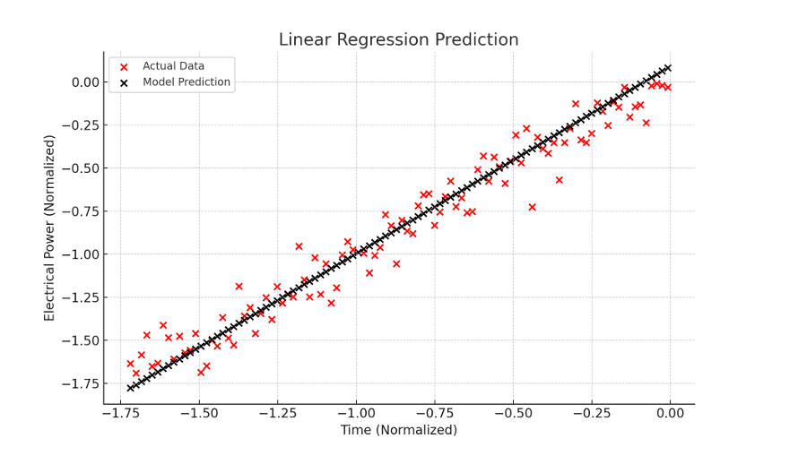

# Univariate Linear Regression with Gradient Descent

This project demonstrates a general-purpose implementation of **Univariate Linear Regression** using **Gradient Descent**, built from scratch with **NumPy** and **Matplotlib**.

## 🔍 Overview

Linear Regression is one of the most fundamental machine learning algorithms used to model the relationship between a single feature (input) and a continuous target (output).

This project:
- Builds a regression model without using high-level ML libraries.
- Uses normalized data for better gradient descent convergence.
- Visualizes both the model prediction and the cost function over time.

## 🧠 Key Concepts
- **Univariate Regression**: Learning a relationship between one feature and the target.
- **Gradient Descent**: Optimizing model parameters to minimize prediction error.
- **Mean Squared Error (MSE)**: Used as the cost function.
- **Feature Normalization**: Speeds up convergence of gradient descent.

## 📁 Files Included
- `linear_regression.py`: Python script implementing the algorithm.
- `ex_1.csv`: Sample dataset with one feature and one target.
- `cost function convergence.png`: Shows how the cost decreased with training.
- `module_output.png`: Displays model predictions vs actual data.
- `flowchart.txt`: Text version of the algorithm’s flow.

## 📈 Visualizations

### Cost Function Convergence
This plot shows how the cost function (MSE) decreases over time:


### Prediction vs Actual
This shows how well the final model fits the data:


## ▶️ How to Run

1. Make sure the following packages are installed:
```bash
pip install numpy pandas matplotlib
